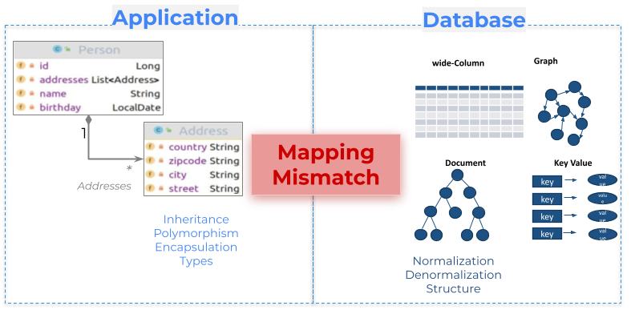
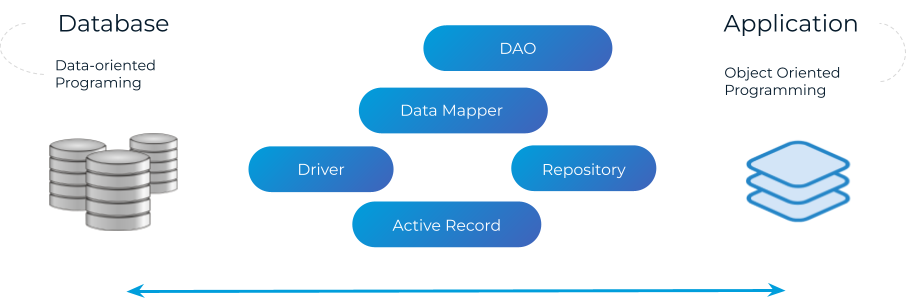

== Persistence—Bridging Applications and Databases

It is almost impossible to imagine a modern software application without handling databases. This is where the persistence layer plays a pivotal role.

The persistence layer connects the application and the database, bringing unique challenges to software development. Comparing changes in the application versus the database highlights these challenges:

* *Application Changes*: Refactoring internal code can often be done seamlessly with an IDE.
* *Database Changes*: Require migrations, which introduce complexity and demand careful planning to ensure consistency.

=== The Challenge of Paradigms

Databases and applications often operate with differing paradigms, creating friction. Applications like those written in Java rely on polymorphism, inheritance, and encapsulation principles. In contrast, databases emphasize normalization and denormalization. This mismatch necessitates using mappers and adapters to bridge the two worlds, a problem commonly called *impedance mismatch*.

[[fig-mapping-mismatch]]

.Caption: Mapping mismatch challenges caused by application and database paradigm differences.

To address this gap, several patterns are employed:

* *Data Access Object (DAO)*: Encapsulates database access, hiding SQL queries from the business logic.
* *Repository*: Focuses on domain-driven access, aligning with objects and encapsulating behavior.
* *Driver*: Provides direct interaction with the database at a lower abstraction level.

Patterns closer to the database tend to expose data and hide behavior, while those closer to the application do the opposite, encapsulating data to expose behavior. Striking the right balance depends on the use case and architectural goals.

[[fig-persistence-patterns]]

.Caption: Bridging databases and applications using persistence patterns.

=== Types of Databases

Databases can be categorized into three main types:

* *SQL*: These databases follow ACID principles and standardized query languages, making them consistent and easy to learn. Modeling is typically based on normalization, reducing data duplication, and ensuring consistency.
* *NoSQL*: Built on the BASE model, NoSQL databases lack the standardization of SQL. Their data storage structure is classified into:
** *Key-Value*: Resembles a Java Map or dictionary structure.
** *Wide-Column*: Specializes in key-value storage, grouping data into tuples called columns.
** *Document*: Utilizes JSON structures for flexible schema representation.
** *Graph*: Focuses on relationships, using objects (nodes) and connections (edges) with properties and directions.
* *NewSQL*: Offers a hybrid solution that combines the scalability of NoSQL with the consistency and standards of SQL.

=== The Ultimate Engineer’s Approach to Persistence

An ultimate software engineer expertly navigates the complexities of persistence by:

* Understanding the trade-offs between SQL, NoSQL, and NewSQL.
* Managing impedance mismatches with appropriate patterns and tools.
* Balancing performance, scalability, and maintainability in database integrations.

By mastering persistence, the ultimate engineer ensures seamless communication between applications and databases, fostering a system that is robust, scalable, and aligned with changing business needs.

