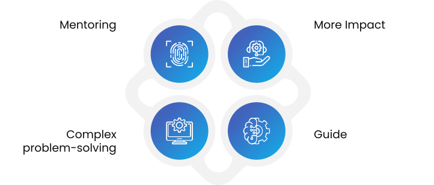

== Leadership—The Bridge to Team Scalability and Success

You may have all the technical skills to design good software; write tests and documentation, and build excellent solutions. Still, as we’ve discussed, software architecture is a mix of people and software integration. This means, leadership is essential to ensure the entire team moves in the right direction.

=== The Blend of Hard and Soft Skills

A software development career requires both hard and soft skills. While hard skills include precise technical abilities like writing code, soft skills focus on adaptability and interpersonal communication—leadership and communication—which some underrate as pivotal soft skills in software engineering. Software development isn’t about ease but flexibility; leadership embodies that principle.

A good tech leader guides the team in the right direction while speaking the same technical language as other software engineers. They balance deep technical knowledge with effective communication, focus on the big picture, execute projects, and level up the team.

=== The Rise of the Staff Engineer Role

In modern software development, there is often a gap between management roles (like managers and directors) and engineering teams. To fill this gap, the staff engineer role is gaining popularity. Will Larson’s 2019 book popularized the role, which can be traced back to the British Navy in 1885, where staff engineers were critical in operating steam-powered fleets.

A staff engineer and an architect do not replace management roles but complement them. The staff engineer combines hard and soft skills, bridging software development's technical and human aspects. They communicate effectively, handle complex problems, and align engineering efforts with organizational goals.

[[fig-engineer-pillars]]

.Caption: Key pillars that define the impact of an Ultimate Engineer.

=== Becoming a Staff Engineer

For those interested in focusing solely on technical aspects, the staff engineer role may not be suitable. This position requires developing leadership capabilities, including soft skills. A staff engineer works with technical and non-technical team members, requiring a balance of technical depth and the ability to influence and inspire others.

=== An Ultimate Engineer’s View on Leadership

An ultimate engineer is a leader who bridges the gap between technical teams and management or stakeholders. They understand that leadership is a practiced skill, evolving alongside technical expertise. Beyond coding and design, leadership includes:

* Effective communication
* Understanding business needs
* Selling ideas and proposals
* Presenting and writing clearly
* Leading teams and cross-team collaboration

An ultimate engineer recognizes that leadership involves more than guiding technical execution. It requires fostering an environment where innovation thrives, team members feel empowered, and goals are achieved collaboratively. By mastering hard and soft skills, the ultimate engineer becomes a technical expert and a trusted leader capable of navigating the complexities of modern software development.

